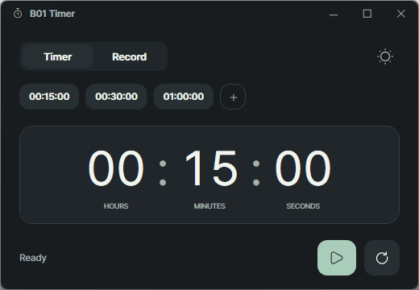
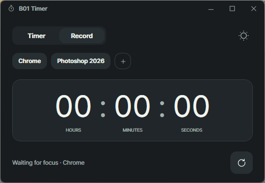

# B01 Timer

A portable Windows countdown timer and automatic foreground time recorder with reusable presets and light/dark themes.

[Download the latest release](https://github.com/BE0X01/b01-timer/releases/latest)

## Preview

<p align="center">
  
  
</p>

## Features

- Editable hours, minutes and seconds, with reusable countdown presets.
- Automatic foreground time recording for up to five programs.
- Timer and Record work together while the app stays open.
- Light/dark themes and portable settings saved beside the EXE.

## Download

Supports Windows 10/11 x64. No installation or separate .NET runtime is required.

1. Download the ZIP from [GitHub Releases](https://github.com/BE0X01/b01-timer/releases/latest).
2. Extract it to a folder you can write to.
3. Run `B01Timer.exe`.

The ZIP contains `B01Timer.exe`, `LICENSE` and `THIRD-PARTY-NOTICES.txt`.

## Usage

### Timer

Click a time field and type digits. Short input replaces the selected field; longer input fills preceding fields. These examples start from `00:00:00`:

| Field | Input | Result |
| --- | --- | --- |
| Hours | `40` | `40:00:00` |
| Minutes | `408` | `04:08:00` |
| Seconds | `123000` | `12:30:00` |

Press Enter or move focus to confirm; Escape restores the previous input. Minutes and seconds normalize overflow. The maximum time is `99:59:59`.

- Play starts or resumes the countdown. Pause preserves the remaining time.
- Reset restores the latest time you configured and waits.
- Select a preset to set the time without starting. Use `+` to add one; right-click a preset to Edit or Remove it.
- Editing a running timer pauses it. Adding or editing a preset keeps the countdown running in the background.

When the countdown finishes, `Time’s up` appears and two three-beep phrases play. Reset or configuring a new time stops the alert. After reopening the app, the timer waits at the latest configured time; an active countdown does not resume.

### Record

Switch to Record and use `+` to enter a title and select a currently running program. You can register up to five different executable paths. Start the target program first if it is missing; the dropdown refreshes each time you open it.

- Each program automatically accumulates time while one of its windows is in the foreground. There is no start/pause action.
- Select a chip to display its total. All registered programs remain eligible for tracking.
- Right-click a chip to Edit or Remove it. Reset clears only the selected record.
- Closing and reopening a target program continues its record when the executable path matches.

The clock shows `hh:mm:ss` within the current day. At 24 hours, it wraps to `00:00:00` and shows a `1d` badge. Seven days becomes `1w`, followed by `1w 1d`, and so on. The badge keeps the clock and controls in place.

The app must stay open to measure time. Sleep, lock and closed-app time do not accrue. A program remains eligible while focused even without keyboard input. Switching between Timer and Record keeps both features running.

### Shortcuts

| Key | Action |
| --- | --- |
| Space | Start/pause Timer when outside a time input |
| Ctrl+R | Reset the current timer or selected record |
| Enter | Confirm a time input |
| Escape | Restore the previous time input |

## Settings

Use the sun/moon button at the top right to switch themes.

Theme, presets, registered programs, record totals and the latest configured time are saved in `B01Timer.ini` beside the EXE when the app closes normally. Changes stay in memory during use; the first INI is created on the first normal close. Forced termination or a crash loses that session’s unsaved changes.

Keep the app in a writable folder. Move the whole folder to keep your settings and records with it.

## Development

<details>
<summary>Build, verification, release policy and design references</summary>

### Build and verification

Requires Windows and the .NET 10 SDK.

```powershell
# Run core checks and publish a self-contained EXE to artifacts/publish
./scripts/build.ps1

# Verify the real Windows UI and capture screenshots
./scripts/qa-ui.ps1 -ExePath ./artifacts/publish/B01Timer.exe

# Verify foreground recording with five distinct probe programs
./scripts/qa-record.ps1 -ExePath ./artifacts/publish/B01Timer.exe
```

Record verification covers foreground tracking, tab switching, reset, restart, the registration limit and day/week badges. Delivery results are documented in [docs/qa-report.md](docs/qa-report.md).

### Releases

[GitHub Actions](.github/workflows/windows-build.yml) builds and verifies application, test, build-script and release-related changes on `main`, and runs verification for pull requests. Use Run workflow on `main` for a delivery build at any time. README-only updates do not trigger a push build.

A successful `main` build publishes the verified ZIP to GitHub Releases. Pull request builds produce verification artifacts only. Failed tests or packaging checks prevent publication. GUI results, screenshots and checksums are retained as Actions artifacts; checksums are not included in the ZIP. Older standalone EXE, checksum and license release assets are removed after a successful update.

The release version comes from `InformationalVersion` in [B01Timer.csproj](src/B01Timer/B01Timer.csproj). Version `0.3` uses tag `v0.3` and title `Version 0.3`. Set the next version before a versioned delivery. Rebuilding the same version replaces its assets and points its tag to the verified source commit. Release notes link to that commit and the Windows verification run.

### Technical notes

- WPF with per-monitor DPI scaling. Pretendard 1.3.9 Regular/SemiBold is embedded, including tabular timer digits; no font installation is required.
- Timer and Record keep digits, colons and labels in the same positions while waiting, paused, running or recording.
- Countdown timing uses a monotonic clock, independently of UI updates.
- Settings use readable INI sections and `hh:mm:ss` timer values, saved through atomic file replacement on normal close. Record entries store `Title`, `ExecutablePath` and `ElapsedTicks` in 100 ns units, including fractional seconds. A valid pending time edit and the last foreground interval are included before saving.
- If no portable INI exists, legacy settings from `%LOCALAPPDATA%\B01Timer\settings.json` are read and written to the INI on normal close. The original JSON is kept.

### Design references

[docs/design-spec.md](docs/design-spec.md) describes the design. The editable [Figma style guide](https://www.figma.com/design/F3jN688KWp9JsFV7JSqPs7) contains color variables, typography, vector icons and reusable components for both themes.

The Figma preview represents an earlier design and uses Inter/Roboto Mono because Segoe UI/Consolas were unavailable in the connected editor. The Windows app now uses embedded Pretendard. Current differences and verified limitations are listed in [docs/figma-style-guide.md](docs/figma-style-guide.md); [docs/figma-design-map.json](docs/figma-design-map.json) maps Figma IDs to source files.

For a design update, edit the relevant Figma variables or component variants and request implementation with the file or node link. The mapping connects the design to WPF resources and controls. Implementation changes undergo Windows verification before release.

</details>

## License

Source code is licensed under [MIT](LICENSE). Icons are from [Reicon](https://reicon.dev/icons?weight=outline); their license notices are included in [THIRD-PARTY-NOTICES.txt](THIRD-PARTY-NOTICES.txt).
